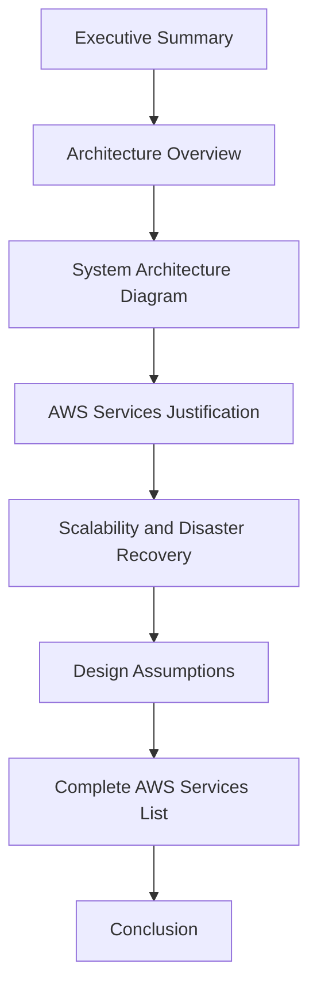

```mermaid
graph TD
    A[Executive Summary] --> B[Architecture Overview]
    B --> C[System Architecture Diagram]
    C --> D[AWS Services Justification]
    D --> E[Scalability and Disaster Recovery]
    E --> F[Design Assumptions]
    F --> G[Complete AWS Services List]
    G --> H[Conclusion]
```
