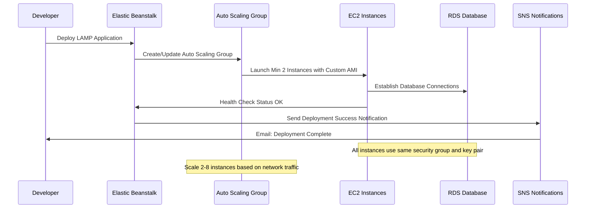
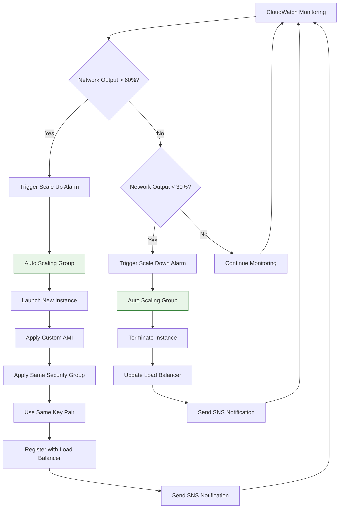

# Additional Mermaid Diagrams for AWS LAMP Deployment

## 1. Deployment Sequence Diagram

## 2. Auto Scaling Flow Diagram

## 3. Security Architecture Diagram

```mermaid
graph TB
    subgraph Internet["🌐 Internet"]
        Users[👥 Users]
    end

    subgraph VPC["🏢 Custom VPC - 10.0.0.0/16"]
        subgraph PublicZone["📡 Public Subnets"]
            subgraph SG_App["🛡️ Application Security Group (sg-0c443ff6565523254)"]
                EC2_1[🖥️ EC2-1<br/>HTTP: 80 ✅<br/>SSH: 22 ✅]
                EC2_2[🖥️ EC2-2<br/>HTTP: 80 ✅<br/>SSH: 22 ✅]
                EC2_N[🖥️ EC2-N<br/>HTTP: 80 ✅<br/>SSH: 22 ✅]
            end
        end

        subgraph DatabaseZone["🗄️ Database Zone"]
            subgraph SG_DB["🛡️ Database Security Group (sg-08175128c04dbd867)"]
                RDS[🗄️ RDS MySQL<br/>Port: 3306<br/>Source: App SG Only]
            end
        end
    end

    subgraph KeyManagement["🔑 Key Management"]
        KeyPair[🔐 Unified Key Pair<br/>custom-lamp-key-pair<br/>ALL instances use same key]
    end

    Users -->|HTTPS/HTTP| EC2_1
    Users -->|HTTPS/HTTP| EC2_2
    Users -->|HTTPS/HTTP| EC2_N

    EC2_1 -.->|MySQL:3306| RDS
    EC2_2 -.->|MySQL:3306| RDS
    EC2_N -.->|MySQL:3306| RDS

    KeyPair -.->|SSH Access| EC2_1
    KeyPair -.->|SSH Access| EC2_2
    KeyPair -.->|SSH Access| EC2_N

    classDef security fill:#ffebee,stroke:#b71c1c,stroke-width:2px
    classDef compute fill:#e8f5e8,stroke:#1b5e20,stroke-width:2px
    classDef database fill:#fff3e0,stroke:#e65100,stroke-width:2px

    class SG_App,SG_DB,KeyPair security
    class EC2_1,EC2_2,EC2_N compute
    class RDS database
```

## 4. Network Topology Diagram

```mermaid
graph TB
    subgraph AWS_Region["🌍 AWS Region us-east-1"]

        subgraph AZ1["🏗️ us-east-1a"]
            Subnet1[📡 Public Subnet 1<br/>10.0.1.0/24<br/>subnet-038f2f355ee2000a5]
            EC2_1a[🖥️ EC2 Instance]
            RDS_1[🗄️ RDS Primary]
        end

        subgraph AZ2["🏗️ us-east-1b"]
            Subnet2[📡 Public Subnet 2<br/>10.0.2.0/24<br/>subnet-06f4e63adf671e7ea]
            EC2_2a[🖥️ EC2 Instance]
            EC2_2b[🖥️ EC2 Instance]
            RDS_2[🗄️ RDS Standby]
        end

        subgraph AZ3["🏗️ us-east-1c"]
            Subnet3[📡 Public Subnet 3<br/>10.0.3.0/24<br/>subnet-0xxx]
            EC2_3a[🖥️ EC2 Instance]
            EC2_3b[🖥️ EC2 Instance]
        end

        ELB[⚖️ Classic Load Balancer<br/>Cross-AZ Distribution]
        IGW[🚪 Internet Gateway]

    end

    Internet[🌐 Internet] --> IGW
    IGW --> ELB

    ELB --> EC2_1a
    ELB --> EC2_2a
    ELB --> EC2_2b
    ELB --> EC2_3a
    ELB --> EC2_3b

    EC2_1a -.-> RDS_1
    EC2_2a -.-> RDS_1
    EC2_2b -.-> RDS_1
    EC2_3a -.-> RDS_1
    EC2_3b -.-> RDS_1

    RDS_1 -.->|Sync Replication| RDS_2

    classDef az1 fill:#e3f2fd,stroke:#0d47a1
    classDef az2 fill:#f3e5f5,stroke:#4a148c
    classDef az3 fill:#e8f5e8,stroke:#1b5e20

    class AZ1,Subnet1,EC2_1a,RDS_1 az1
    class AZ2,Subnet2,EC2_2a,EC2_2b,RDS_2 az2
    class AZ3,Subnet3,EC2_3a,EC2_3b az3
```

## 5. Disaster Recovery Flow Diagram

```mermaid
flowchart TD
    A[🟢 Normal Operation] --> B{Health Check Failure?}
    B -->|Instance Failure| C[🔴 EC2 Instance Down]
    B -->|Database Failure| D[🔴 RDS Primary Down]
    B -->|AZ Failure| E[🔴 Availability Zone Down]
    B -->|No Issues| A

    C --> F[Auto Scaling Group Detects]
    F --> G[Launch Replacement Instance]
    G --> H[Apply Custom AMI]
    H --> I[Register with Load Balancer]
    I --> J[🟢 Service Restored]

    D --> K[RDS Automatic Failover]
    K --> L[Promote Standby to Primary]
    L --> M[Update Application Connections]
    M --> N[🟢 Database Service Restored]

    E --> O[Load Balancer Routes to Healthy AZ]
    O --> P[Auto Scaling Launches in Healthy AZ]
    P --> Q[🟢 Cross-AZ Redundancy Active]

    J --> R[📧 SNS Alert: Instance Recovered]
    N --> S[📧 SNS Alert: Database Failover]
    Q --> T[📧 SNS Alert: AZ Failover]

    R --> A
    S --> A
    T --> A

    style A fill:#e8f5e8,stroke:#2e7d32
    style C fill:#ffebee,stroke:#c62828
    style D fill:#ffebee,stroke:#c62828
    style E fill:#ffebee,stroke:#c62828
    style J fill:#e8f5e8,stroke:#2e7d32
    style N fill:#e8f5e8,stroke:#2e7d32
    style Q fill:#e8f5e8,stroke:#2e7d32
```

## 6. Compliance Checklist Diagram

```mermaid
mindmap
  root((AWS LAMP
    Compliance
    ✅ 100%))

    Infrastructure
      ✅ AWS Beanstalk
      ✅ Amazon EC2
      ✅ Custom AMI
      ✅ Custom VPC
        ✅ 2+ AZ Subnets
        ✅ All Public

    Security
      ✅ Custom Security Groups
        ✅ HTTP & SSH
        ✅ All Instances Same SG
      ✅ Custom Key Pairs
        ✅ All Instances Same Keys

    Scalability
      ✅ Load Balancer
      ✅ Auto Scaling
        ✅ Min: 2 instances
        ✅ Max: 8 instances
        ✅ Network Traffic Triggers
        ✅ Upper: 60%
        ✅ Lower: 30%

    Database
      ✅ RDS MySQL
      ✅ Multi-AZ Deployment
      ✅ Automatic Backups

    Monitoring
      ✅ CloudWatch
      ✅ SNS Notifications
      ✅ Email Alerts
      ✅ EB Environment Events
```

---

## Usage Instructions

### For VS Code:
1. Install "Mermaid Preview" extension
2. Open any `.md` file with mermaid code
3. Right-click → "Open Preview to the Side"
4. View rendered diagrams in real-time

### For Documentation:
- Copy any diagram code into your documentation
- Diagrams will render in GitHub, GitLab, and most markdown viewers
- Use for presentations, reports, and technical documentation

### For AWS CLI Integration:
Use these diagrams alongside your AWS CLI commands to validate:
- Architecture compliance
- Security configurations
- Scaling policies
- Disaster recovery procedures
