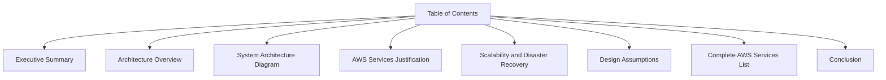

```mermaid
graph TD
    A[Table of Contents] --> B[Executive Summary]
    A --> C[Architecture Overview]
    A --> D[System Architecture Diagram]
    A --> E[AWS Services Justification]
    A --> F[Scalability and Disaster Recovery]
    A --> G[Design Assumptions]
    A --> H[Complete AWS Services List]
    A --> I[Conclusion]
```
